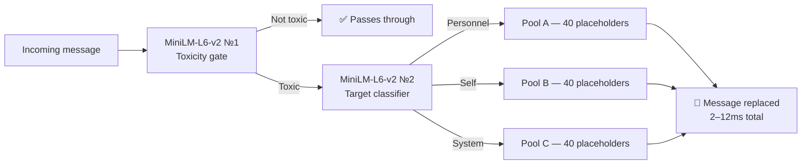

# The 2026 Systems Architect’s Guide to Real-Time Community Defense

## High-Throughput Edge Inference, Zero-Allocation Memory, and Automated De-Escalation Architecture

### Executive Summary

Traditional server moderation relies on reactive paradigms: string-matching regular expressions (Regex) executed over managed heap memory, followed by destructive message deletions. At enterprise scale (50,000+ concurrent members), this model introduces catastrophic structural bottlenecks. Coordinated raid traffic exhausts garbage collection (GC) budgets via continuous string allocation, while regex parsers fall victim to regular expression denial of service (ReDoS) or false positives (the Scunthorpe problem).

This playbook outlines a modern, deterministic framework architecture designed by our team to solve high-concurrency moderation. By uniting **$O(1)$ Zero-Allocation Ingress**, **Dual-Gate Edge Semantic Inference**, and **Target-Aware De-Escalation**, server maintainers can achieve sub-12 millisecond threat mitigation without relying on external cloud APIs or violating data sovereignty.

---

### Module 1: The Ingress Bottleneck & $O(1)$ Memory Vanguard

#### Core Engineering Problem

When high-capacity guilds face automated raid attacks (e.g., distributed spam bots flooding webhooks), standard bot frameworks instantiate new immutable string objects on the heap for every `MESSAGE_CREATE` event. 

In managed runtimes (.NET, Node.js, JVM), allocating memory for thousands of concurrent payloads triggers frequent Generation 0/1 Garbage Collection sweeps. These sweeps introduce non-deterministic execution spikes, pausing event loop processing and causing bot disconnections or rate-limit penalties. Furthermore, processing incoming text through complex regex filters creates algorithmic vulnerability: nested quantifiers in regex patterns can degrade to $O(2^n)$ or $O(n^2)$ time complexity when parsing crafted adversarial inputs (ReDoS).

#### The Technical Standard: Zero-Allocation Ingress & Numerical Hashing

To survive raid-level concurrency without degrading execution latency, the ingress gateway must operate under two absolute architectural constraints: **Zero Heap Allocation during pre-processing** and **$O(1)$ constant-time known-threat interception**.

Instead of deserializing JSON payloads directly into managed strings, high-throughput systems should utilize stack-allocated memory views (such as `Span<T>` or `ReadOnlySpan<char>`). Text normalization—including flattening Cyrillic homoglyphs, stripping zero-width joiners, and sanitizing Zalgo diacritics—must execute in-place over stack buffers.

> **Ingress Pipeline Architecture:**
> `[MESSAGE_CREATE Webhook]` -> Ingress Layer: Stack-Allocated `Span<T>` Buffer (In-Place Homoglyph & Zalgo Sanitization) -> L0 Fingerprint Engine: 64-Bit FNV-1a / xxHash -> Hash Match Check ($O(1)$ Cache Lookup). If Match: Execute L0 Mirror Cache (Instant Action / 0ms CPU). If Miss: Route to Semantic Matrix (Gate 1 & Gate 2 Triage).

Once normalized, the pipeline computes a deterministic 64-bit numerical hash (using non-cryptographic, high-speed hashing algorithms like xxHash or FNV-1a) directly from the `Span<T>` window. 

#### The Reference Implementation Bridge

Our team engineered the **L0 Mirror Cache Vanguard** to solve this ingress bottleneck. By caching known raid payloads and previously classified hostile intent as 64-bit integers (`L0FingerprintEngine`), the gateway evaluates repeat traffic in strict $O(1)$ time. 

If a raid wave hits the server, the first message undergoes full evaluation; subsequent occurrences hit the L0 numeric lookup table and trigger pre-cached actions instantly. This prevents the attack traffic from ever utilizing CPU-intensive machine learning inference or consuming cloud LLM token budgets. Server architects can inspect our zero-allocation ingress pipeline directly in our open reference repository on [github](https://github.com/aegitox/aegitox).

---

### Module 2: The Semantic Matrix & Head-Tail Optimization

#### Core Engineering Problem

Attempting to moderate complex community interactions with static keyword blacklists creates structural failure modes:

1. **The Scunthorpe Problem:** Substrings inside benign words trigger false-positive penalties, punishing active community members and eroding retention.
2. **Adversarial Obfuscation:** Trolls easily bypass static filters using Markdown spacing, vertical alignment, or semantic evasion.

While replacing word lists with machine learning vector embeddings solves accuracy, standard transformer inference scales linearly or quadratically ($O(n^2)$) with token sequence length. Feeding raw 2,000-character copypastas or multi-paragraph rants into local inference engines destroys latency budgets, pushing processing times beyond acceptable limits.

#### The Technical Standard: Head-Tail Compression Heuristic

To reconcile deep semantic accuracy with extreme execution speed, architectures must exploit structural human communication patterns. Adversarial chat payloads consistently concentrate intent at the boundaries of a transmission: the opening hook (the "head") or the concluding punchline (the "tail"). Trolls frequently pad the middle of long messages with benign text or ASCII art to confuse linear parsers.

Our team established the **64-Character Head-Tail Compression Heuristic**. When an incoming payload exceeds 64 characters, the engine dynamically slices the buffer: extracting the first 32 characters and the final 32 characters, concatenating them into a dense, unified evaluation window. This guarantees that vector embedding generation operates on a fixed, predictable dimensional input regardless of total message length.

#### Visual Anchor: Dual-Gate Semantic Matrix

* **Gate 1 (Toxicity Triage):** Evaluates raw semantic intent, generating a normalized confidence vector ($0.0$ to $1.0$). Payloads scoring below $0.15$ bypass moderation immediately. Payloads exceeding the absolute $0.92$ confidence threshold are flagged for instantaneous interception.
* **Gate 2 (Intent & Target Mapping):** Toxic payloads immediately route to the secondary edge classifier, which maps the hostility to a strict 0-indexed matrix: *Personal* (`Index 0`), *Self* (`Index 1`), or *System* (`Index 2`).

By processing bounded Head-Tail buffers entirely within local RAM, our team's dual-gate architecture completes full semantic triage and targeting in 2–12 milliseconds—a benchmark verified in our live performance telemetry check [here](https://www.youtube.com/watch?v=GzQDc0M7gVo).

---

### Module 3: Target-Aware De-Escalation Architecture

#### Core Engineering Problem

Traditional moderation bots rely on brute-force deletion (`MESSAGE_DELETE`). In high-velocity channels, silent deletions cause immediate psychological friction:

* **The Conversational Vacuum:** Removing a message leaves other users responding to dead threads, disrupting chat continuity.
* **The Retaliation Loop:** Offending users immediately re-type the message or publicly challenge moderation staff, escalating a minor infraction into a server-wide disruption.

#### The Technical Standard: Automated Game Theory & Redaction

Modern community governance requires moving from punitive deletion to **Context-Aware De-Escalation**. When Gate 2 identifies the precise target of hostile intent, the engine executes dynamic message redaction—replacing the hostile payload in real time while preserving the user's presence in the conversation flow.

De-escalation must be mathematically categorized to match the intent target:

1. **Personal Attacks (`Index 0`):** Interventions must defuse interpersonal aggression without shaming either party (e.g., redirecting the tone toward constructive debate).
2. **Self-Directed Toxicity (`Index 1`):** Interventions must immediately pivot toward supportive, community-safe wellness pivots.
3. **System/Server Attacks (`Index 2`):** Interventions must re-establish institutional authority neutrally and concisely.

#### The Reference Implementation Bridge

To prevent redaction stubs from becoming repetitive or feeling robotic, systems require broad, randomized variation pools. As an open-source contribution to the community, our team has published our complete directory of **120 lock-free de-escalation placeholders** (40 unique, culturally tuned stubs per target index). 

Server architects building custom moderation pipelines can integrate these vetted stubs directly from our open repository on [github](https://github.com/aegitox/aegitox) to immediately deploy target-aware de-escalation in their own guilds.

---

### Module 4: Zero-Retention Compliance & Judicial Appeals

#### Core Engineering Problem

Enterprise server architects face severe data privacy obligations (GDPR, CCPA). Third-party AI moderation bots that log user text to persistent external databases create massive compliance liabilities and security vectors. Simultaneously, enforcing strict timeout rules creates operational exhaustion for human moderators, who are routinely swamped by bad-faith appeal tickets from quarantined users.

#### The Technical Standard: Volatile RAM Execution & Procedural Risk

True enterprise defense requires a **Zero Data Retention (ZDR)** architecture. On local edge nodes, incoming text evaluation must occur strictly within volatile system memory (RAM). The moment Gate 1 and Gate 2 compute the classification vector, the input buffer must be explicitly zeroed and purged from memory. No chat history may ever write to disk or persist in a database.

For disciplinary enforcement, automated systems must implement procedural fairness backed by mathematical deterrence:

> **Disciplinary Enforcement & Appeal Flow:**
> `[Hostile Payload > 0.92]` -> Autonomous Isolation (Soft Quarantine Role Applied) -> Private Appeal Thread Generated (1-Click Defense). If User Appeals -> Human Moderator Reviews Telemetry. If Verdict Approved -> Immediate Quarantine Lift & Karma Restored. If Verdict Rejected -> **DOUBLE OR NOTHING ENFORCEMENT:** Original Penalty Duration Doubled.

When an account drops below custom Karma thresholds or commits severe infractions, the engine applies a **Soft Quarantine** (`communication_disabled_until`). To protect staff bandwidth while preserving fairness, the engine initiates a **Double-or-Nothing Appeal Matrix**:

1. The isolated user receives an immediate, dedicated private thread containing the flagged category and an interactive appeal submission form.
2. If the user submits an appeal, human staff review the telemetry strictly in human hands.
3. **The Game-Theoretic Deterrent:** If the human moderator rejects the appeal as bad-faith or frivolous, the system autonomously **doubles the duration** of the original timeout. This structural risk metric eliminates spam appeals, ensuring staff only spend bandwidth reviewing genuine edge cases.
