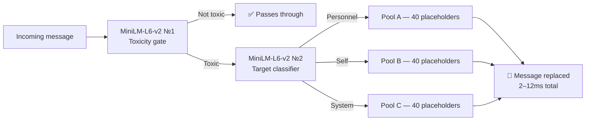

  

  # Aegitox - Discord AI Moderation

  > *Deploy a zero-latency defensive grid for your community. Aegitox replaces manual oversight with a deterministic AI pipeline. Before anyone can read them, toxic payloads are intercepted, deleted, and instantly replaced with target-aware de-escalation placeholders. By mapping hostile intent to its exact target, the engine enforces precision disciplinary protocols with zero latency.*

  **[Home](https://aegitox.com)**  |  **[Features](https://aegitox.com/#features)**  |  **[Pricing Plans](https://aegitox.com/#pricing)**  |  **[FAQ](https://aegitox.com/#faq)**  |  **[Terms of Service](https://aegitox.com/terms)**  |  **[Privacy Policy](https://aegitox.com/privacy)**  |  **[Refund Policy](https://aegitox.com/refund)**

 

## Technical Architecture & Core AI Interceptor

 

## The Aegitox Advantage

* **⚡ O(1) Execution:** Algorithmic supremacy guarantees **2–12ms response times**. Toxicity is intercepted before the payload renders on the client side.
* **🧠 Dual MiniLM-L6-v2:** A two-stage edge inference pipeline. Gate 1 detects toxicity. Gate 2 calculates the exact directional threat vector.
* **🛡️ 120 Placeholders:** No generative AI hallucinations. Threats are mapped to **static, pre-vetted de-escalation stubs** to instantly neutralize drama.

## Why Legacy Moderation Fails

* **❌ The Drama:** Legacy bots delete messages after the entire chat reads them. The damage is done. Your moderators manage the fallout, not the cause.
* **❌ False Positives:** Keyword filters can't identify friendly trash talk. Real members get warnings. Actual offenders bypass filters. Trust is lost.
* **❌ The Burnout:** Manual moderation burns out your volunteer staff. Moderator burnout is your most expensive hidden cost. Protect your team.
* **❌ The Liability:** Standard bots log your community's chat history to unsecured databases indefinitely, and spam user DMs with penalties. Your server becomes a data farm.

## Technical Architecture & Core AI Interceptor

* **Local Edge Architecture:** Proprietary engine achieving toxicity detection and placeholder deployment in 2-12 milliseconds, bypassing standard local hardware constraints.
* **Algorithmic Supremacy:** Built on strict $O(1)$ constant-time execution mandates with zero-allocation memory management.
* **Semantic Pipeline:** Powered by a dual MiniLM-L6-v2 model matrix. Evaluates intent mathematically via a normalized semantic confidence vector (0.0 to 1.0) rather than relying on basic keyword filtering.
* **Target-Aware De-Escalation:** Hostility is surgically isolated. The bot deploys context-aware stubs over text modification, softening the atmosphere without muting the entire chat.

## Enterprise PRO Infrastructure

* **OpenRouter Deep AI Cluster:** Complex "Grey Zone" moderation is routed via a VIP priority lane directly to our dedicated OpenRouter Deep AI endpoints.
* **System Prompt Governance:** Total control over the bot's personality. Inject custom system prompts to dictate the exact tone (strict corporate vs. gaming banter) Aegitox uses during community interaction.
* **Scale:** Safely supports massive scaling; architecture handles up to 700 requests per day per server (RPD), safely supporting 1,000 maxed-out servers before hitting global rate limits.

## Automated Penalty Engine & Disciplinary Protocols

* **Karma Analytics:** Tracks behavioral patterns using a detailed karma metric. Breaching custom karma thresholds triggers autonomous action.
* **Judicial Mode (Human-in-the-Loop):** Generates a private incident Discord Thread for appeals. Staff retain the final verdict via an interactive "Appeal Decision" interface.
* **The Troll Deterrent:** If an appeal is rejected by human staff, the system autonomously doubles the Time Out duration penalty.
* **Zero-Tolerance Mode:** For massive guilds facing bot raids. Bypasses appeals and instantly executes Discord's native `communication_disabled_until` cryptographic gag.

## Data Privacy & Zero-Trust Security

* **Absolute Data Sovereignty:** Strict Zero Data Retention (ZDR) architecture.
* **Volatile RAM Processing:** All text processing occurs exclusively in memory; data is mathematically purged the exact millisecond threat evaluation completes. 
* **No Training Data:** Chat logs are never written to a database, never logged to a disk, and explicitly never utilized to train AI models.
* **Secure Billing:** All transactions are securely processed by our Merchant of Record, PayPro Global.
